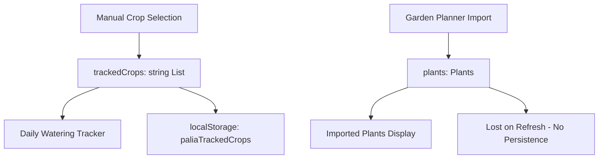
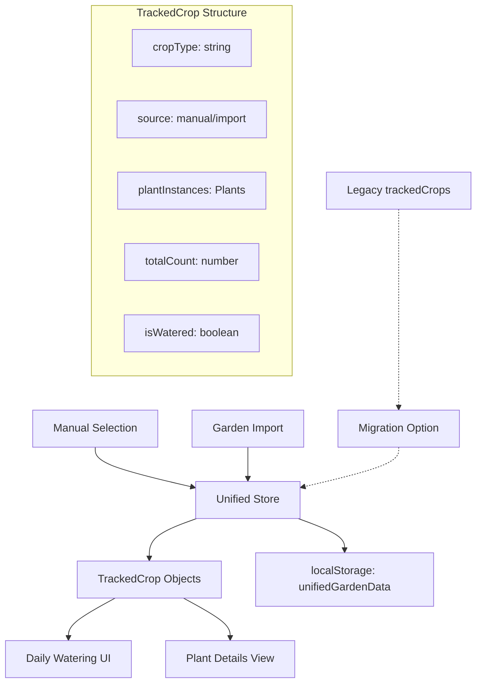
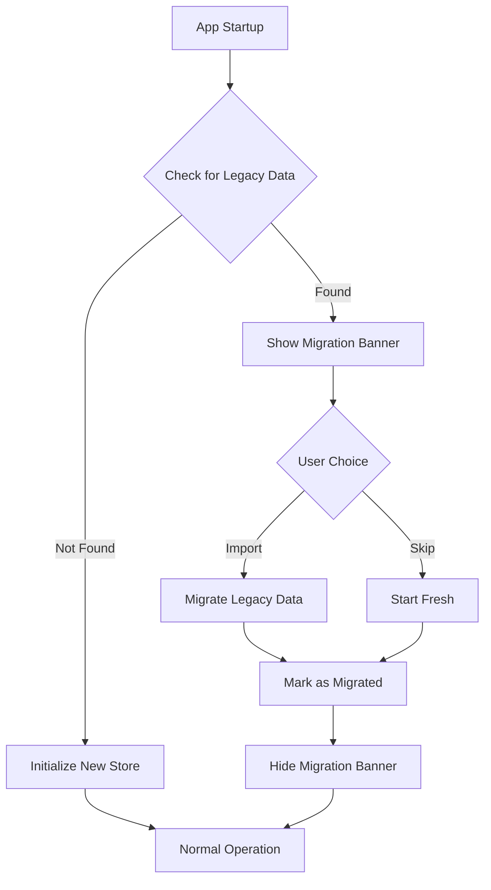

# Unified Crop Tracking Architecture Design

## Executive Summary

This design merges the dual state systems (`trackedCrops` string[] and `plants` Plant[]) into a unified Zustand store that maintains unique crop tracking for daily watering while preserving detailed plant information from Garden Planner imports.

## Current Architecture Analysis

### Issues Identified:
1. **Dual State Systems**: [`trackedCrops`](../src/App.tsx:115) (string[]) vs [`plants`](../src/hooks/useGardenStore.ts:5) (Plant[])
2. **No Integration**: Systems don't communicate or sync
3. **Persistence Gap**: Only `trackedCrops` persisted, `plants` lost on refresh
4. **Data Mismatch**: Import creates multiple Plant instances, but daily tracking needs unique crops

### Current Data Flow:


## Proposed Solution Architecture

### 1. New Unified Store Structure

```typescript
interface TrackedCrop {
  /** Unique crop type identifier */
  cropType: string;
  /** Source of this crop entry */
  source: 'manual' | 'import';
  /** Individual plant instances (for imported crops) */
  plantInstances: Plant[];
  /** Total count of this crop type */
  totalCount: number;
  /** Daily watering state */
  isWatered: boolean;
  /** When this crop was added to tracking */
  addedAt: Date;
  /** Last time this crop was watered */
  lastWateredAt?: Date;
}

interface UnifiedGardenStore {
  /** All tracked crops (unique by type) */
  trackedCrops: TrackedCrop[];
  /** Daily watering state management */
  dailyWateringState: {
    lastResetDay: string;
    resetTime: number; // 6 AM reset
  };
  /** Store actions */
  addCropManually: (cropType: string) => void;
  removeCrop: (cropType: string) => void;
  importPlantsFromGarden: (plants: Plant[]) => void;
  toggleCropWatered: (cropType: string) => void;
  waterAllCrops: () => void;
  resetDailyWatering: () => void;
  /** Migration utilities */
  importFromLegacyData: (legacyTrackedCrops: string[]) => void;
}
```

### 2. Data Flow Architecture



### 3. Integration Strategy

#### A. Conversion Logic
- **Manual Selection**: Creates `TrackedCrop` with `source: 'manual'`, `totalCount: 1`, empty `plantInstances`
- **Garden Import**: Groups Plant[] by `name`, creates `TrackedCrop` per unique type with `source: 'import'`, populated `plantInstances`

#### B. Daily Watering Logic
- Single checkbox per crop type regardless of source
- Watering a crop type marks ALL instances as watered
- Reset at 6 AM maintains existing behavior
- Progress tracking based on unique crop types, not individual plants

### 4. UI Component Changes

#### A. Daily Watering Tracker
```typescript
// Current: Maps over trackedCrops (string[])
trackedCrops.map(cropName => ...)

// New: Maps over unified TrackedCrop objects
store.trackedCrops.map(trackedCrop => (
  <CropWateringItem
    key={trackedCrop.cropType}
    cropType={trackedCrop.cropType}
    totalCount={trackedCrop.totalCount}
    source={trackedCrop.source}
    isWatered={trackedCrop.isWatered}
    onToggle={() => store.toggleCropWatered(trackedCrop.cropType)}
  />
))
```

#### B. Plant Details Section
- Show expandable details for imported crops
- Display individual plant instances when available
- Maintain existing [`PlantComponent`](../src/components/PlantComponent.tsx:9) for detailed view

### 5. Persistence Strategy

#### A. New Storage Structure
```typescript
interface PersistedGardenData {
  version: '2.0';
  trackedCrops: TrackedCrop[];
  dailyWateringState: {
    lastResetDay: string;
    resetTime: number;
  };
  migratedFromLegacy: boolean;
}
```

#### B. Storage Keys
- **New**: `'paliaUnifiedGarden'` - Complete unified data
- **Legacy**: Keep `'paliaTrackedCrops'` for migration detection
- **Watering State**: Merge into unified storage

### 6. Migration Implementation

#### A. Migration Detection & Flow


#### B. Migration Component
```typescript
const MigrationBanner: React.FC = () => {
  const [showMigration, setShowMigration] = useState(false);
  
  useEffect(() => {
    const legacyData = localStorage.getItem('paliaTrackedCrops');
    const newData = localStorage.getItem('paliaUnifiedGarden');
    setShowMigration(!!legacyData && !newData);
  }, []);
  
  // ... migration UI
};
```

### 7. Implementation Phases

#### Phase 1: Core Store Implementation
1. Create new `useUnifiedGardenStore` hook
2. Implement `TrackedCrop` interface and store actions
3. Add persistence layer with new storage structure
4. Create migration utilities

#### Phase 2: UI Integration
1. Update [`App.tsx`](../src/App.tsx:67) to use unified store
2. Modify daily watering tracker to use new data structure
3. Update import modal to use new store actions
4. Add migration banner component

#### Phase 3: Enhanced Features
1. Add plant details expansion for imported crops
2. Implement crop source indicators in UI
3. Add bulk operations (water all from import, etc.)
4. Enhanced filtering and sorting options

#### Phase 4: Migration & Cleanup
1. Deploy migration system
2. Monitor migration success rates
3. Clean up legacy code after migration period
4. Remove old localStorage keys

### 8. Backward Compatibility

#### A. Graceful Degradation
- Detect and handle malformed legacy data
- Provide fallback for failed migrations
- Maintain existing daily reset logic during transition

#### B. Data Validation
```typescript
const validateTrackedCrop = (crop: any): crop is TrackedCrop => {
  return (
    typeof crop.cropType === 'string' &&
    ['manual', 'import'].includes(crop.source) &&
    Array.isArray(crop.plantInstances) &&
    typeof crop.totalCount === 'number' &&
    typeof crop.isWatered === 'boolean'
  );
};
```

### 9. Benefits of This Architecture

1. **Unified State**: Single source of truth for all crop tracking
2. **Preserved Functionality**: Maintains unique crop tracking requirement
3. **Enhanced Import**: Detailed plant information preserved but simplified for daily use
4. **Persistent Storage**: All data survives page refreshes
5. **Migration Path**: Smooth transition for existing users
6. **Extensible**: Easy to add new features like crop notes, custom groupings, etc.

### 10. Technical Considerations

#### A. Performance
- Zustand provides efficient re-renders
- Group operations reduce individual plant updates
- Lazy loading for plant details when needed

#### B. Data Integrity
- Validation on store updates
- Atomic operations for daily resets
- Backup/restore capabilities for critical data

#### C. Testing Strategy
- Unit tests for store actions and reducers
- Integration tests for migration logic
- E2E tests for complete user workflows

### 11. File Structure Changes

```
src/
├── hooks/
│   ├── useGardenStore.ts (deprecated)
│   └── useUnifiedGardenStore.ts (new)
├── types/
│   ├── index.ts (updated with TrackedCrop)
│   └── unified.ts (new unified types)
├── components/
│   ├── MigrationBanner.tsx (new)
│   ├── CropWateringItem.tsx (new)
│   └── PlantDetailsExpander.tsx (new)
├── services/
│   └── migrationService.ts (new)
└── utils/
    └── cropGrouping.ts (new)
```

### 12. API Changes Summary

#### Removed APIs
- `useGardenStore().plants` - Replaced by unified tracking
- Direct `trackedCrops` state management in App.tsx

#### New APIs
- `useUnifiedGardenStore().trackedCrops` - Main data source
- `useUnifiedGardenStore().addCropManually()` - Manual crop addition
- `useUnifiedGardenStore().importPlantsFromGarden()` - Import integration
- `useUnifiedGardenStore().toggleCropWatered()` - Daily watering toggle

#### Modified APIs
- Import modal now calls unified store instead of separate plant store
- Daily watering UI consumes unified crop data instead of separate arrays

This architecture provides a robust foundation that addresses all identified issues while maintaining existing functionality and providing a clear path for future enhancements.

## Next Steps

1. **Review & Approval**: Stakeholder review of this architectural design
2. **Implementation Planning**: Break down into specific development tasks
3. **Migration Strategy**: Plan rollout and user communication
4. **Testing Plan**: Define comprehensive testing approach
5. **Documentation**: Update user-facing documentation for new features

---

*Document Version: 1.0*  
*Created: 2025-06-16*  
*Author: Kilo Code (Architect Mode)*