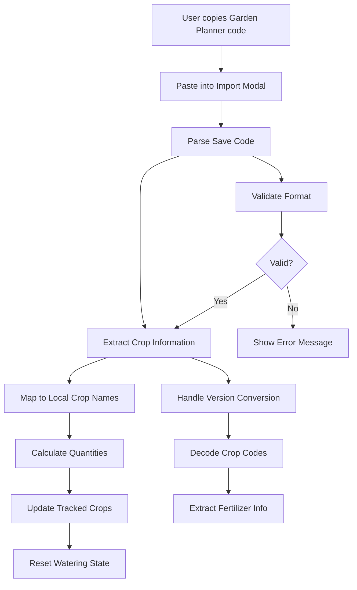
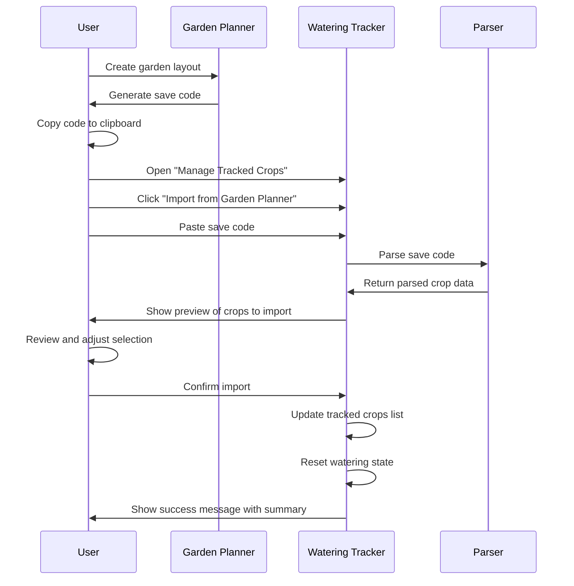

# Palia Garden Planner Integration Plan

## Overview

This document outlines the integration plan for importing garden layouts from the Palia Garden Planner app into the Palia Watering Tracker. The integration will allow users to copy garden codes from the planner and automatically populate their tracked crops list.

## Garden Planner Export System Analysis

### Save Code Structure

The Garden Planner uses a sophisticated encoding system for garden layouts:

```
Format: v{version}_{dimensionInfo}_{cropInfo}_{settingsInfo}
Example: v0.4_9x9-111111111-111111111-111111111-111111111-111111111-111111111-111111111-111111111-111111111_CR-T.S-P-R-W.S-Co-B-A-Cr-S-Cb-Bk-Pm-Bt_D7L0
```

#### Components Breakdown:

1. **Version**: `v0.4` - Current format version
2. **Dimension Info**: `9x9-111111111-...` - Garden size and plot layout
3. **Crop Info**: `CR-T.S-P-R-W.S-Co-B-A-...` - Encoded crop placements
4. **Settings Info**: `D7L0` - Harvester and processor settings

### Crop Code Mappings (v0.4)

```typescript
const CROP_CODE_MAPPINGS = {
  'N': 'None',
  'T': 'Tomato', 
  'P': 'Potato',
  'R': 'Rice',
  'W': 'Wheat',
  'C': 'Carrot',
  'O': 'Onion',
  'Co': 'Cotton',
  'B': 'Blueberry',
  'A': 'Apple',
  'Cr': 'Corn',
  'S': 'Spicy Pepper',
  'Cb': 'Napa Cabbage',
  'Bk': 'Bok Choy',
  'Pm': 'Rockhopper Pumpkin',
  'Bt': 'Batterfly Bean'
}
```

### Fertilizer Code Mappings

```typescript
const FERTILIZER_CODE_MAPPINGS = {
  'N': 'None',
  'S': 'Speedy Gro',
  'Q': 'Quality Up',
  'W': 'Weed Block',
  'H': 'Harvest Boost',
  'Y': 'Hydrate Pro'
}
```

## Integration Architecture



## Implementation Plan

### Phase 1: Core Parser Implementation

#### 1. Garden Parser Module (`src/utils/gardenParser.ts`)

**Core Functions:**
- `parseGardenCode(saveCode: string): ParsedGarden`
- `validateSaveCode(saveCode: string): boolean`
- `extractCropQuantities(cropInfo: string): CropQuantity[]`
- `mapCropCodesToNames(crops: string[]): string[]`

**Data Structures:**
```typescript
interface ParsedGarden {
  version: string;
  dimensions: { width: number; height: number };
  crops: CropQuantity[];
  settings?: GardenSettings;
  isValid: boolean;
  errors: string[];
}

interface CropQuantity {
  code: string;
  name: string;
  quantity: number;
  fertilizer?: string;
  isStar?: boolean;
  hasGrowthBoost?: boolean;
}

interface GardenSettings {
  harvestDays: number;
  includeReplant: boolean;
  includeReplantCost: boolean;
  useGrowthBoost: boolean;
  useStarSeeds: boolean;
  level: number;
}
```

#### 2. Version Conversion System

**Support for Legacy Versions:**
- v0.1 → v0.2 conversion
- v0.2 → v0.3 conversion  
- v0.3 → v0.4 conversion
- Automatic version detection and upgrade

**Conversion Functions:**
- `convertV0_1CodestoV0_2(save: string): string`
- `convertV_0_2Codesto_V_0_3(save: string): string`
- `convertV_0_3Codesto_V_0_4(save: string): string`

#### 3. Crop Name Mapping

**Mapping Strategy:**
```typescript
const CROP_NAME_MAPPINGS = {
  // Garden Planner → Watering Tracker
  'Blueberry': 'Blueberries',
  'Batterfly Bean': 'Batterfly Beans',
  // Add more mappings as needed
}
```

### Phase 2: UI Integration

#### 4. Import Modal Component

**New UI Elements:**
- "Import from Garden Planner" button in crop management modal
- Import textarea with validation
- Crop preview table showing detected crops and quantities
- Import statistics display
- Error message display area

**Modal Flow:**
1. User clicks "Import from Garden Planner"
2. Modal expands to show import section
3. User pastes garden code
4. Real-time validation and preview
5. User confirms import
6. Success message with import summary

#### 5. Enhanced Crop Management

**Modifications to Existing Components:**
- Add import source indicator to crop list items
- Bulk selection/deselection for imported crops
- Import history dropdown
- Manual quantity adjustment (future feature)

### Phase 3: Advanced Features

#### 6. Import Validation & Error Handling

**Validation Checks:**
- Save code format validation
- Version compatibility check
- Crop code recognition
- Dimension validation
- Settings parsing validation

**Error Types:**
```typescript
enum ImportErrorType {
  INVALID_FORMAT = 'Invalid save code format',
  UNSUPPORTED_VERSION = 'Unsupported version',
  UNKNOWN_CROPS = 'Unknown crop codes detected',
  EMPTY_LAYOUT = 'No crops found in layout',
  PARSING_ERROR = 'Failed to parse save code'
}
```

#### 7. Import History & Management

**Features:**
- Store last 10 imports in localStorage
- Quick re-import from history
- Import metadata (date, crop count, source)
- Clear import history option

**Data Structure:**
```typescript
interface ImportHistory {
  id: string;
  date: string;
  saveCode: string;
  cropCount: number;
  cropNames: string[];
  source: 'manual' | 'url' | 'file';
}
```

## Technical Implementation Details

### Parser Algorithm

```typescript
function parseGardenCode(saveCode: string): ParsedGarden {
  // 1. Split save code into components
  const [version, dimensionInfo, cropInfo, settingsInfo] = saveCode.split('_');
  
  // 2. Validate and convert version
  const parsedSave = parseSave(saveCode);
  
  // 3. Extract crop information
  const cropSection = parsedSave.cropInfo.replace('CR-', '');
  const cropCodes = cropSection.split('-');
  
  // 4. Parse individual crop codes
  const crops = cropCodes.map(parseCropCode);
  
  // 5. Calculate quantities
  const quantities = calculateCropQuantities(crops);
  
  // 6. Map to local crop names
  const mappedCrops = mapCropCodesToNames(quantities);
  
  return {
    version: parsedSave.version,
    dimensions: parseDimensions(parsedSave.dimensionInfo),
    crops: mappedCrops,
    settings: parseSettings(parsedSave.settingsInfo),
    isValid: true,
    errors: []
  };
}
```

### Crop Code Parsing

```typescript
function parseCropCode(cropCode: string): ParsedCropCode {
  // Format: CropCode[.Fertilizer][~GrowthBoost]
  // Example: "T.S" = Tomato with Speedy Gro
  // Example: "W~" = Wheat with Growth Boost
  
  const regex = /^([A-Z][a-z]?)(?:\.([A-Z][a-z]?))?(?:(~))?$/;
  const match = cropCode.match(regex);
  
  if (!match) {
    throw new Error(`Invalid crop code: ${cropCode}`);
  }
  
  return {
    cropCode: match[1],
    fertilizerCode: match[2] || 'N',
    hasGrowthBoost: !!match[3],
    isStar: !match[2] // No fertilizer = star seed
  };
}
```

### Integration with Existing App

**Modified Components:**
1. **App.tsx**: Add import functionality to crop modal
2. **CropListItem**: Add import source indicator
3. **localStorage**: Extend to store import history

**New Files:**
1. `src/utils/gardenParser.ts` - Core parsing logic
2. `src/components/ImportModal.tsx` - Import UI component
3. `src/types/garden.ts` - Type definitions
4. `src/utils/cropMapping.ts` - Crop name mappings

## User Experience Flow



## Data Flow Example

### Input Garden Code:
```
v0.4_9x9-111111111-111111111-111111111-111111111-111111111-111111111-111111111-111111111-111111111_CR-T.S-P-R-W.S-Co-B-A-Cr-S-Cb-Bk-Pm-Bt_D7L0
```

### Parsed Output:
```typescript
{
  version: "0.4",
  dimensions: { width: 9, height: 9 },
  crops: [
    { code: "T", name: "Tomato", quantity: 1, fertilizer: "Speedy Gro" },
    { code: "P", name: "Potato", quantity: 1 },
    { code: "R", name: "Rice", quantity: 1 },
    { code: "W", name: "Wheat", quantity: 1, fertilizer: "Speedy Gro" },
    { code: "Co", name: "Cotton", quantity: 1 },
    { code: "B", name: "Blueberries", quantity: 1 },
    { code: "A", name: "Apple", quantity: 1 },
    { code: "Cr", name: "Corn", quantity: 1 },
    { code: "S", name: "Spicy Pepper", quantity: 1 },
    { code: "Cb", name: "Napa Cabbage", quantity: 1 },
    { code: "Bk", name: "Bok Choy", quantity: 1 },
    { code: "Pm", name: "Rockhopper Pumpkin", quantity: 1 },
    { code: "Bt", name: "Batterfly Beans", quantity: 1 }
  ],
  settings: {
    harvestDays: 7,
    level: 0,
    includeReplant: true,
    includeReplantCost: true,
    useGrowthBoost: false,
    useStarSeeds: true
  },
  isValid: true,
  errors: []
}
```

### Final Tracked Crops:
```typescript
[
  "Tomato", "Potato", "Rice", "Wheat", "Cotton", 
  "Blueberries", "Apple", "Corn", "Spicy Pepper", 
  "Napa Cabbage", "Bok Choy", "Rockhopper Pumpkin", 
  "Batterfly Beans"
]
```

## Error Handling Strategy

### Error Categories:

1. **Format Errors**
   - Invalid save code structure
   - Missing required components
   - Malformed version string

2. **Version Errors**
   - Unsupported version
   - Failed version conversion
   - Corrupted version data

3. **Crop Errors**
   - Unknown crop codes
   - Invalid crop format
   - Missing crop mappings

4. **Data Errors**
   - Empty garden layout
   - Invalid dimensions
   - Corrupted settings

### Error Messages:

```typescript
const ERROR_MESSAGES = {
  INVALID_FORMAT: "Invalid garden code format. Please check your code and try again.",
  UNSUPPORTED_VERSION: "This garden code version is not supported. Please update your Garden Planner.",
  UNKNOWN_CROPS: "Some crops in your garden are not recognized. Import will continue with known crops.",
  EMPTY_LAYOUT: "No crops found in this garden layout.",
  PARSING_ERROR: "Failed to parse garden code. Please verify the code is complete and try again."
};
```

## Benefits of Integration

1. **Seamless Workflow**: Plan in Garden Planner, track in Watering Tracker
2. **Reduced Manual Entry**: Automatically populate complex crop lists
3. **Accuracy**: Eliminate manual selection errors
4. **Efficiency**: Quick setup for large gardens
5. **Flexibility**: Support for all Garden Planner versions and features
6. **Future-Proof**: Extensible architecture for additional features

## Future Enhancements

1. **Layout Visualization**: Show garden layout in watering tracker
2. **Fertilizer Tracking**: Track fertilizer usage per crop
3. **Harvest Scheduling**: Calculate optimal harvest times
4. **Export Functionality**: Export watering data back to Garden Planner
5. **Batch Operations**: Import multiple garden layouts
6. **Garden Comparison**: Compare different layout options

## Testing Strategy

### Unit Tests:
- Parser function validation
- Version conversion accuracy
- Crop code mapping correctness
- Error handling coverage

### Integration Tests:
- End-to-end import flow
- UI component interaction
- localStorage persistence
- Error state handling

### Test Cases:
- Valid garden codes (all versions)
- Invalid/malformed codes
- Empty gardens
- Large complex gardens
- Edge cases and boundary conditions

## Implementation Timeline

### Week 1: Core Parser
- Implement basic parsing logic
- Add version conversion support
- Create crop mapping system
- Unit tests for parser

### Week 2: UI Integration
- Add import button to crop modal
- Create import preview interface
- Implement error handling UI
- Integration testing

### Week 3: Advanced Features
- Add import history
- Implement validation improvements
- Polish user experience
- Documentation and testing

### Week 4: Testing & Refinement
- Comprehensive testing
- Bug fixes and optimizations
- User feedback integration
- Final documentation

This integration will significantly enhance the user experience by bridging the gap between garden planning and watering management, creating a seamless workflow for Palia players.