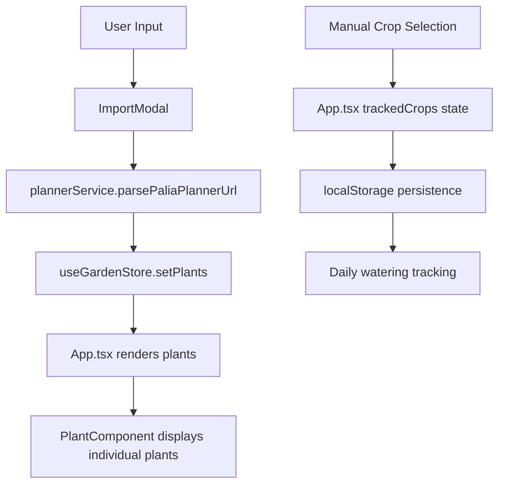
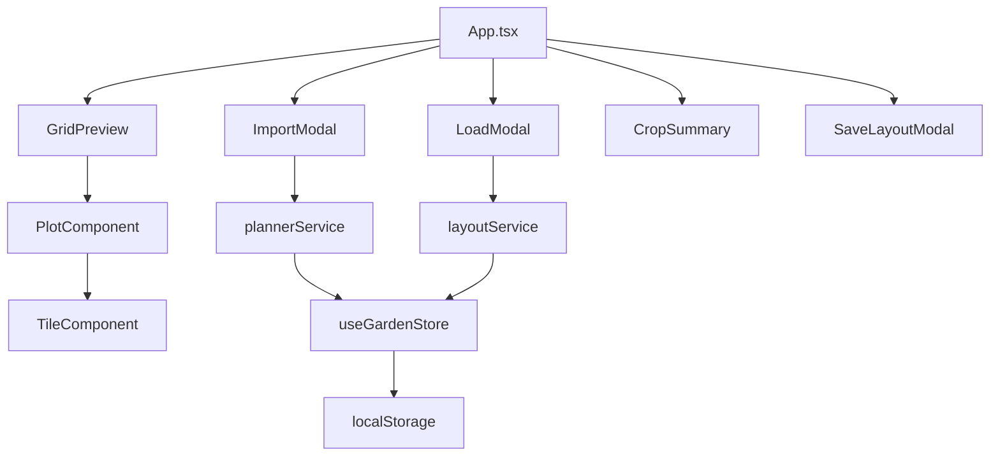
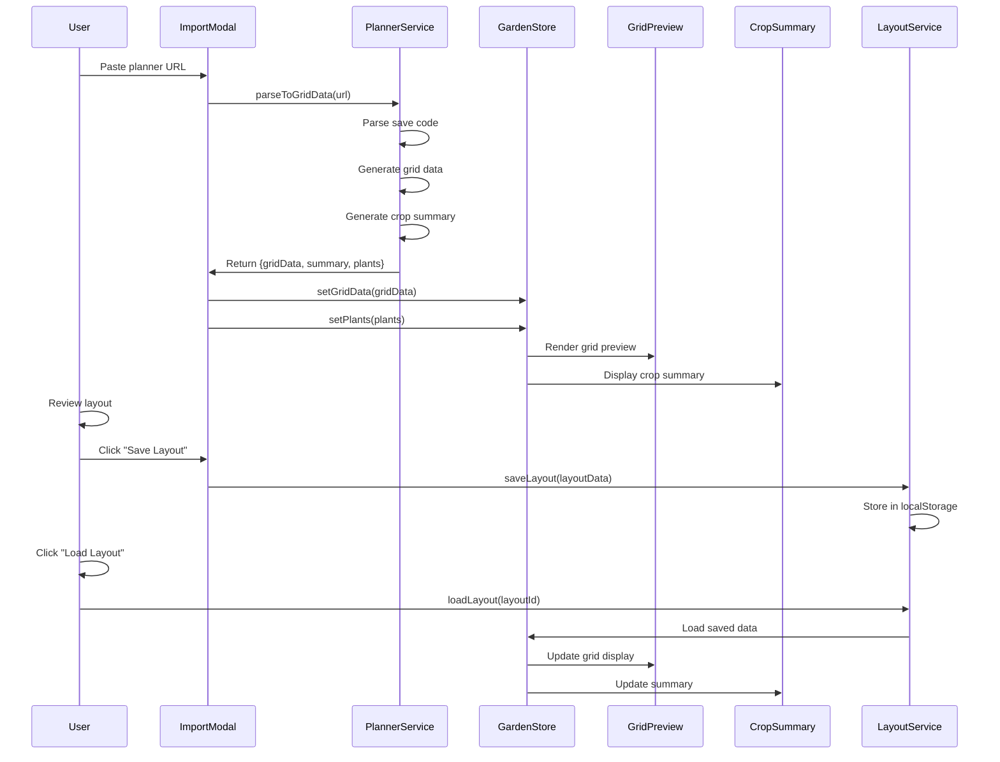

# Palia Watering Tracker - Technical Design Document

## Executive Summary

This document provides a comprehensive technical analysis of the current Palia Watering Tracker application and outlines the architectural design for implementing new features including grid preview, summary display, save/load functionality, and enhanced crop tracking integration.

## Current Architecture Analysis

### 1. Application Structure

```
src/
├── App.tsx                    # Main application component
├── index.tsx                  # Application entry point
├── index.css                  # Global styles
├── components/
│   ├── ImportModal.tsx        # Garden planner import modal
│   └── PlantComponent.tsx     # Individual plant display component
├── hooks/
│   └── useGardenStore.ts      # Zustand state management
├── services/
│   └── plannerService.ts      # Garden planner integration service
└── types/
    └── index.ts               # Type definitions
```

### 2. Current Data Flow



### 3. Current State Management

#### Garden Store (Zustand)
```typescript
interface GardenStore {
  plants: Plant[];
  setPlants: (plants: Plant[]) => void;
  addPlant: (plant: Plant) => void;
  toggleWater: (id: string) => void;
}
```

#### App-level State (React useState)
- `trackedCrops: string[]` - Manually selected crops for tracking
- `cropWateringState: CropWateringState` - Daily watering status
- `cycleWateringState: CycleWateringState` - 5-cycle watering history
- `allCrops: any[]` - Crop database loaded from crops.json

### 4. Current Data Structures

#### Plant Interface
```typescript
interface Plant {
  id: string;
  name: string;
  needsWater: boolean;
}
```

#### Crop Watering State
```typescript
interface CropWateringState {
  watered: { [cropName: string]: boolean };
  lastResetDay: string;
}
```

### 5. Planner Integration Analysis

The current [`plannerService.ts`](src/services/plannerService.ts) provides:
- Save code parsing from palia-garden-planner.vercel.app URLs
- Crop code to name mapping
- Multi-tile crop handling (bushes: 4 tiles, trees: 9 tiles)
- Plant count calculation based on tile usage

#### Palia-Tools Planner Structure Analysis

From [`palia-tools/assets/scripts/garden-planner/`](palia-tools/assets/scripts/garden-planner/):

**Core Classes:**
- [`Garden`](palia-tools/assets/scripts/garden-planner/classes/garden.ts): Main garden container with Plot[][] layout
- [`Plot`](palia-tools/assets/scripts/garden-planner/classes/plot.ts): 3x3 tile grid with adjacency management
- [`Tile`](palia-tools/assets/scripts/garden-planner/classes/tile.ts): Individual tile with crop, fertilizer, and bonus data
- [`Crop`](palia-tools/assets/scripts/garden-planner/classes/crop.ts): Crop definitions with size, bonuses, and growth data

**Key Data Structures:**
- Garden layout: `Plot[][]` (variable dimensions)
- Plot tiles: `Tile[3][3]` (fixed 3x3 grid per plot)
- Crop sizes: Single (1 tile), Bush (4 tiles), Tree (9 tiles)
- Bonus system: Adjacent crop bonuses and fertilizer effects

## Proposed Architecture

### 1. Enhanced Data Structures

#### Saved Layout Interface
```typescript
interface SavedLayout {
  id: string;
  name: string;
  description?: string;
  saveCode: string;
  parsedData: ParsedGardenData;
  createdAt: string;
  lastUsed: string;
  cropSummary: CropSummary;
}

interface ParsedGardenData {
  version: string;
  dimensions: { rows: number; cols: number };
  plots: PlotData[][];
  totalCrops: { [cropName: string]: number };
  uniqueCrops: string[];
}

interface PlotData {
  isActive: boolean;
  tiles: TileData[][];
}

interface TileData {
  crop: CropData | null;
  fertilizer: FertilizerData | null;
  position: { row: number; col: number };
  id: string;
}

interface CropData {
  type: string;
  name: string;
  size: 'single' | 'bush' | 'tree';
  imageUrl: string;
  groupId?: string; // For multi-tile crops
}

interface FertilizerData {
  type: string;
  name: string;
  effect: string;
  imageUrl: string;
}

interface CropSummary {
  totalPlants: number;
  uniqueTypes: number;
  needsWatering: number;
  cropBreakdown: { [cropName: string]: number };
}
```

#### Enhanced Garden Store
```typescript
interface GardenStore {
  // Current functionality
  plants: Plant[];
  setPlants: (plants: Plant[]) => void;
  addPlant: (plant: Plant) => void;
  toggleWater: (id: string) => void;
  
  // New functionality
  currentLayout: SavedLayout | null;
  savedLayouts: SavedLayout[];
  
  // Layout management
  saveCurrentLayout: (name: string, description?: string) => void;
  loadLayout: (layoutId: string) => void;
  deleteLayout: (layoutId: string) => void;
  updateLayoutName: (layoutId: string, name: string) => void;
  
  // Grid preview data
  gridData: ParsedGardenData | null;
  setGridData: (data: ParsedGardenData) => void;
  clearGridData: () => void;
  
  // Summary data
  summary: CropSummary | null;
  updateSummary: () => void;
}
```

### 2. Component Architecture



#### New Components

##### GridPreview Component
```typescript
interface GridPreviewProps {
  gridData: ParsedGardenData;
  showFertilizers?: boolean;
  showBonuses?: boolean;
  interactive?: boolean;
  onTileClick?: (tile: TileData) => void;
}

// Features:
// - Visual representation matching palia-tools planner
// - Crop images and fertilizer indicators
// - Hover effects and tooltips
// - Responsive grid layout
// - Zoom and pan functionality for large gardens
```

##### PlotComponent
```typescript
interface PlotComponentProps {
  plotData: PlotData;
  plotPosition: { row: number; col: number };
  tileSize: number;
  showGrid: boolean;
  onTileClick?: (tile: TileData) => void;
}

// Features:
// - 3x3 tile grid rendering
// - Active/inactive plot states
// - Tile hover effects
// - Crop and fertilizer display
```

##### TileComponent
```typescript
interface TileComponentProps {
  tileData: TileData;
  size: number;
  showTooltip: boolean;
  onClick?: () => void;
}

// Features:
// - Crop image display
// - Fertilizer overlay
// - Bonus indicators
// - Hover tooltips with crop details
```

##### CropSummary Component
```typescript
interface CropSummaryProps {
  summary: CropSummary;
  showWateringStatus: boolean;
  onCropClick?: (cropName: string) => void;
}

// Features:
// - Total plant count
// - Crops needing water count
// - Breakdown by crop type
// - Visual progress indicators
// - Quick watering actions
```

##### LoadModal Component
```typescript
interface LoadModalProps {
  isOpen: boolean;
  onClose: () => void;
  onLoadLayout: (layout: SavedLayout) => void;
}

// Features:
// - Saved layouts list
// - Layout preview thumbnails
// - Search and filter functionality
// - Layout management (rename, delete)
// - Import date and usage statistics
```

##### SaveLayoutModal Component
```typescript
interface SaveLayoutModalProps {
  isOpen: boolean;
  onClose: () => void;
  currentLayout: ParsedGardenData;
  onSave: (name: string, description?: string) => void;
}

// Features:
// - Layout naming
// - Description input
// - Preview of layout to be saved
// - Validation and error handling
```

### 3. Service Layer Architecture

#### Enhanced Planner Service
```typescript
// Extend existing plannerService.ts
export interface PlannerService {
  // Existing functionality
  parsePaliaPlannerUrl(input: string): Promise<Plant[]>;
  
  // New functionality
  parseToGridData(input: string): Promise<ParsedGardenData>;
  generateCropSummary(gridData: ParsedGardenData): CropSummary;
  extractUniqueTrackedCrops(gridData: ParsedGardenData): string[];
}
```

#### Layout Service
```typescript
export interface LayoutService {
  saveLayout(layout: SavedLayout): void;
  loadLayout(layoutId: string): SavedLayout | null;
  getAllLayouts(): SavedLayout[];
  deleteLayout(layoutId: string): void;
  updateLayout(layoutId: string, updates: Partial<SavedLayout>): void;
  exportLayout(layoutId: string): string;
  importLayout(data: string): SavedLayout;
}

// Implementation using localStorage
class LocalStorageLayoutService implements LayoutService {
  private readonly STORAGE_KEY = 'palia-saved-layouts';
  private readonly MAX_LAYOUTS = 50;
  
  // Implementation details...
}
```

#### Grid Renderer Service
```typescript
export interface GridRendererService {
  renderGarden(gridData: ParsedGardenData): JSX.Element;
  renderPlot(plotData: PlotData, position: { row: number; col: number }): JSX.Element;
  renderTile(tileData: TileData): JSX.Element;
  getCropImageUrl(cropType: string): string;
  getFertilizerImageUrl(fertilizerType: string): string;
}
```

### 4. Integration Points

#### With Existing Code

1. **App.tsx Integration**
   - Add new modal states for load/save functionality
   - Integrate GridPreview and CropSummary components
   - Enhance existing import flow to populate grid data
   - Add layout management UI elements

2. **useGardenStore Integration**
   - Extend store with new state properties
   - Add layout management actions
   - Maintain backward compatibility with existing plant tracking

3. **plannerService Integration**
   - Extend parsing to generate full grid data
   - Maintain existing Plant[] generation for compatibility
   - Add crop summary generation

#### New Integration Points

1. **localStorage Integration**
   - Saved layouts storage and retrieval
   - Layout metadata management
   - Storage quota management

2. **Asset Integration**
   - Crop images from palia-tools/public/crops/
   - Fertilizer images from palia-tools/public/fertilisers/
   - UI elements from palia-tools/public/ui/

### 5. Data Flow Architecture



## Implementation Plan

### Phase 1: Core Infrastructure (Week 1)

#### 1.1 Enhanced Data Structures
- Define new TypeScript interfaces
- Extend existing types for backward compatibility
- Create data validation utilities

#### 1.2 Enhanced Planner Service
- Extend [`plannerService.ts`](src/services/plannerService.ts) with grid data parsing
- Add crop summary generation
- Implement tracked crops extraction
- Add comprehensive error handling

#### 1.3 Layout Service Implementation
- Create `layoutService.ts` with localStorage integration
- Implement CRUD operations for saved layouts
- Add data migration utilities
- Implement storage quota management

### Phase 2: Grid Preview System (Week 2)

#### 2.1 Grid Rendering Components
- Implement `GridPreview` component
- Create `PlotComponent` for 3x3 tile grids
- Develop `TileComponent` with crop/fertilizer display
- Add responsive design and zoom functionality

#### 2.2 Asset Integration
- Set up crop image loading from palia-tools assets
- Implement fertilizer image display
- Add fallback images and loading states
- Optimize image loading performance

#### 2.3 Interactive Features
- Add tile hover effects and tooltips
- Implement click handlers for tile details
- Add grid navigation for large gardens
- Include accessibility features

### Phase 3: Summary and Save/Load (Week 3)

#### 3.1 Crop Summary Component
- Implement `CropSummary` with watering status
- Add crop breakdown visualization
- Include quick watering actions
- Add filtering and sorting options

#### 3.2 Save/Load Modals
- Create `SaveLayoutModal` with naming and description
- Implement `LoadModal` with layout management
- Add layout preview thumbnails
- Include search and filter functionality

#### 3.3 Enhanced Garden Store
- Extend `useGardenStore` with new state management
- Add layout management actions
- Implement summary calculation logic
- Maintain backward compatibility

### Phase 4: Integration and Polish (Week 4)

#### 4.1 App Integration
- Integrate new components into [`App.tsx`](src/App.tsx)
- Update existing import flow
- Add new UI controls and navigation
- Implement responsive design improvements

#### 4.2 Enhanced Import Modal
- Update [`ImportModal.tsx`](src/components/ImportModal.tsx) with preview
- Add grid preview in import flow
- Include summary display before import
- Add save option during import

#### 4.3 Tracked Crops Integration
- Auto-register unique crops from layouts
- Sync with existing manual crop selection
- Update watering tracking integration
- Add bulk watering operations

## Technical Considerations

### Performance Optimizations

1. **Grid Rendering**
   - Virtual scrolling for large gardens
   - Memoized tile components
   - Lazy loading of crop images
   - Efficient re-rendering strategies

2. **Data Management**
   - Debounced localStorage writes
   - Compressed layout data storage
   - Efficient data structures for lookups
   - Memory management for large layouts

3. **Asset Loading**
   - Image preloading strategies
   - CDN integration for crop images
   - Fallback image handling
   - Progressive image loading

### Error Handling

1. **Parse Errors**
   - Graceful degradation for invalid save codes
   - Detailed error messages for users
   - Fallback to existing import flow
   - Error reporting and logging

2. **Storage Errors**
   - localStorage quota exceeded handling
   - Data corruption recovery
   - Migration error handling
   - Backup and restore functionality

3. **Rendering Errors**
   - Missing asset handling
   - Invalid data structure recovery
   - Component error boundaries
   - Graceful fallbacks

### Browser Compatibility

1. **localStorage Support**
   - Feature detection and fallbacks
   - Storage quota management
   - Cross-tab synchronization
   - Data persistence validation

2. **Modern JavaScript Features**
   - ES6+ feature usage
   - Polyfill requirements
   - Browser support matrix
   - Progressive enhancement

## Testing Strategy

### Unit Tests
- Planner service parsing functions
- Layout service CRUD operations
- Component rendering logic
- Data validation utilities

### Integration Tests
- End-to-end import flow
- Save/load functionality
- Grid preview rendering
- Summary calculation accuracy

### Performance Tests
- Large garden rendering performance
- Memory usage optimization
- Asset loading efficiency
- localStorage operation speed

## Future Enhancements

### Advanced Features
1. **Layout Comparison Tool**
   - Side-by-side layout comparison
   - Difference highlighting
   - Optimization suggestions
   - Performance metrics

2. **Batch Operations**
   - Multiple layout import
   - Bulk crop management
   - Mass watering operations
   - Layout synchronization

3. **Export Functionality**
   - Export to Garden Planner format
   - Share layouts with other users
   - Backup and restore system
   - Cloud synchronization

### UI/UX Improvements
1. **Advanced Grid Features**
   - Minimap for large gardens
   - Layer toggles (crops, fertilizers, bonuses)
   - Grid measurement tools
   - Layout optimization hints

2. **Enhanced Summary**
   - Harvest scheduling
   - Profit calculations
   - Growth time tracking
   - Fertilizer usage analytics

## Conclusion

This technical design provides a comprehensive roadmap for implementing the requested features while maintaining the existing application's functionality and performance. The modular architecture ensures scalability and maintainability, while the phased implementation approach allows for iterative development and testing.

The integration with the existing palia-tools planner data structures ensures compatibility and leverages the robust garden modeling system already in place. The localStorage-based save/load system provides offline functionality while keeping the implementation simple and reliable.

The proposed architecture supports all requested features:
- ✅ Grid preview with full visual representation
- ✅ Crop summary with watering status
- ✅ Save functionality for persistent layouts
- ✅ Load functionality with separate UI flow
- ✅ Automatic tracked crops registration
- ✅ Integration with existing watering tracking system

The design is extensible and provides a solid foundation for future enhancements while maintaining backward compatibility with the current application.